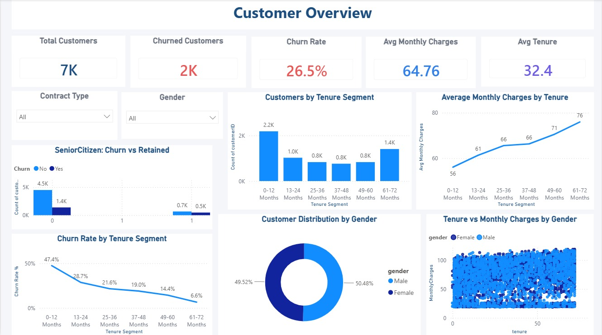
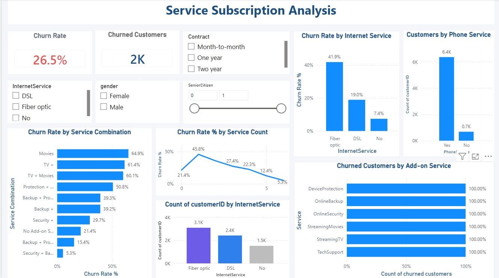
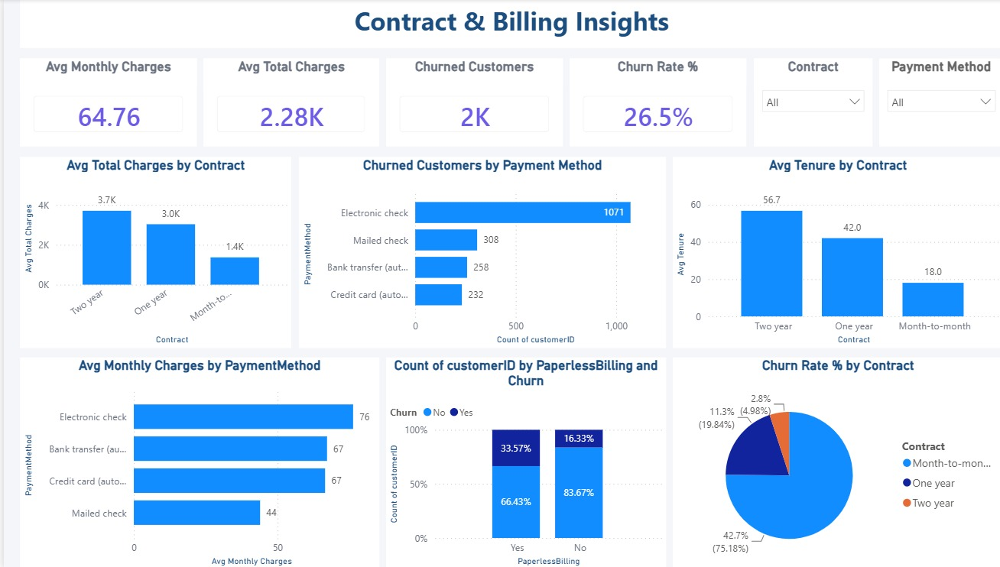
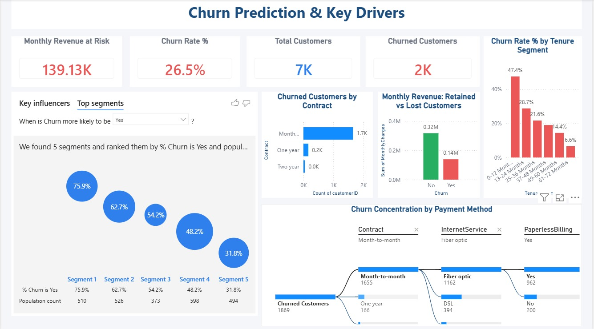

# Telco Customer Churn Analysis – Power BI


---

## 📊 Project Overview

This project analyzes customer churn in a telecommunications company using Microsoft Power BI.

The objective of this project is to understand customer behavior, identify the major factors contributing to customer churn, and provide meaningful business insights through an interactive dashboard.

The analysis focuses on customer demographics, service subscriptions, contracts, billing information, tenure, and churn patterns.

---

## 🎯 Objectives

* Analyze the overall customer churn rate.
* Identify customer segments with high churn rates.
* Understand the relationship between services and customer churn.
* Analyze customer contracts and billing patterns.
* Study churn across different tenure groups.
* Analyze monthly charges and customer behavior.
* Identify factors that may contribute to customer attrition.
* Present actionable business insights through an interactive Power BI dashboard.

---

## 🛠️ Tools & Technologies

* Microsoft Power BI
* Power Query
* DAX
* Data Cleaning
* Data Transformation
* Data Analysis
* Data Visualization
* Excel / CSV

---

## 📁 Dataset

The dataset contains customer-level information related to telecommunications services.

### Key Features

* Customer ID
* Gender
* Senior Citizen
* Partner
* Dependents
* Tenure
* Phone Service
* Multiple Lines
* Internet Service
* Online Security
* Online Backup
* Device Protection
* Tech Support
* Streaming TV
* Streaming Movies
* Contract
* Paperless Billing
* Payment Method
* Monthly Charges
* Total Charges
* Churn

---

## 🧹 Data Preparation

The dataset was prepared using Power Query before creating the dashboard.

The main data preparation steps included:

* Removing unnecessary columns
* Checking and handling missing values
* Correcting data types
* Cleaning categorical values
* Creating meaningful customer segments
* Creating tenure groups
* Preparing the dataset for analysis and visualization

---

## 📐 Key Measures

### Total Customers

```DAX
Total Customers =
DISTINCTCOUNT(Customers[customerID])
```

### Churned Customers

```DAX
Churned Customers =
CALCULATE(
    [Total Customers],
    Customers[Churn] = "Yes"
)
```

### Churn Rate

```DAX
Churn Rate % =
DIVIDE(
    [Churned Customers],
    [Total Customers],
    0
)
```

These measures were used throughout the dashboard to maintain consistent calculations.

---

# 📊 Dashboard Pages

## 1. Customer Overview

The Customer Overview page focuses on customer demographics, tenure, and customer characteristics.

The analysis includes:

* Customer distribution by gender
* Senior citizen analysis
* Partner and dependent status
* Customer tenure
* Tenure segments
* Monthly charges
* Churn patterns across customer segments



---

## 2. Service Subscription Analysis

The Service Subscription Analysis page focuses on customer subscription behavior and the relationship between subscribed services and churn.

The analysis includes:

* Phone service usage
* Internet service
* Add-on services
* Service combinations
* Churn rate by internet service
* Churned customers by add-on service
* Customer service subscription patterns

This page helps identify services and service combinations associated with higher customer churn.



---

## 3. Contract and Billing Insights

The Contract and Billing Insights page analyzes the relationship between customer contracts, billing methods, and churn.

The analysis includes:

* Contract type
* Monthly charges
* Total charges
* Payment method
* Paperless billing
* Churn rate by contract
* Billing-related customer behavior

This page helps identify how contract and billing patterns may influence customer retention.



---

## 4. Churn Analysis

The Churn Analysis page focuses specifically on customer churn patterns.

The analysis examines churn based on different customer characteristics and tenure segments.

Key areas include:

* Churn rate
* Churned customers
* Churn by tenure segment
* Churn patterns across customer segments
* Monthly charges and churn behavior
* Customer retention patterns



---

# 🔍 Key Business Insights

The dashboard provides insights into important customer churn patterns, including:

* Customers with shorter tenure can show higher churn compared with long-term customers.
* Contract type has an important relationship with customer retention.
* Different internet service categories can have different churn rates.
* Add-on services can be analyzed to understand their relationship with customer churn.
* Monthly charges can help identify customer segments that may have a higher likelihood of churn.
* Payment methods and billing behavior provide additional information for understanding customer retention.
* Customer segmentation helps identify groups that may require targeted retention strategies.

---

# 💡 Business Recommendations

### 1. Focus on New Customers

Customers in the early stages of their relationship with the company should receive additional engagement and retention support.

### 2. Encourage Long-Term Contracts

Customers on shorter-term contracts can be encouraged to move toward longer-term contracts through suitable offers, incentives, and loyalty benefits.

### 3. Target High-Risk Customer Segments

Customer segments with higher churn rates can be identified and targeted with personalized retention campaigns.

### 4. Review Service Experience

High-churn service categories should be investigated to identify possible issues related to service quality, pricing, or customer experience.

### 5. Use Personalized Retention Offers

Customer tenure, services, billing information, contract type, and monthly charges can be combined to create targeted retention strategies.

---

# 📷 Dashboard Screenshots

The project contains 4 Power BI dashboard pages:

### Customer Overview


### Service Subscription Analysis


### Contract and Billing Insights


### Churn Analysis


---

# 📂 Project Structure

```text
Telco-Customer-Churn-Analysis-PowerBI/
│
├── screenshots/
│   ├── 01_Customer_Overview.png
│   ├── 02_service_subscription_analysis.png
│   ├── 03_Contract_Billing_Insights.png
│   └── 04_Churn_Prediction_Key_Drivers.png
│
├── Telco-Customer-Churn-Analysis.pbix
│
└── README.md
```

---

# 🚀 Project Workflow

```text
Raw Dataset
     ↓
Data Cleaning
     ↓
Data Transformation
     ↓
Data Modeling
     ↓
DAX Measures
     ↓
Data Analysis
     ↓
Dashboard Development
     ↓
Business Insights
     ↓
Recommendations
```

---

# 📌 Conclusion

The Telco Customer Churn Analysis project demonstrates how Power BI can be used to transform customer data into meaningful business insights.

The dashboard provides an interactive way to explore customer demographics, services, tenure, contracts, billing patterns, and churn behavior.

The analysis can help businesses identify high-risk customer segments, understand the factors associated with customer churn, develop targeted retention strategies, and reduce customer loss.

---

⭐ If you find this project useful, feel free to explore the dashboard and analysis.
